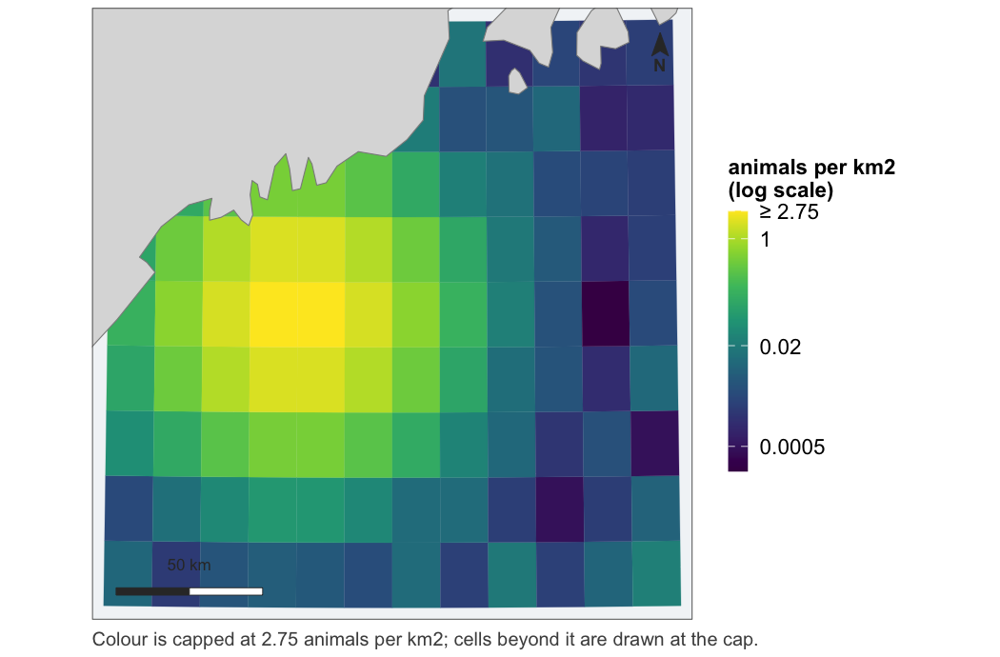
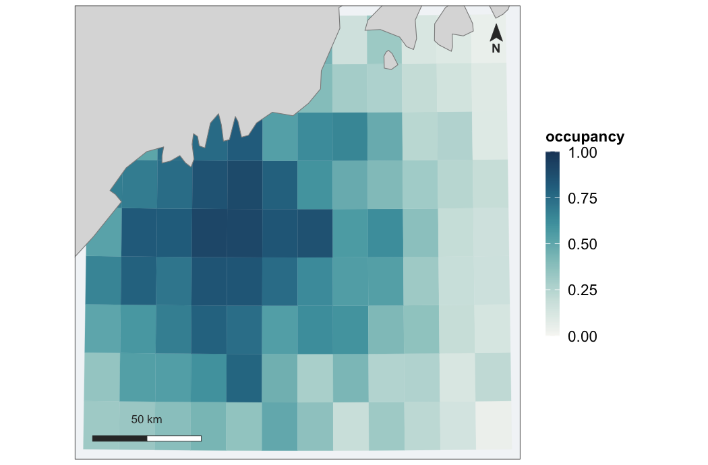
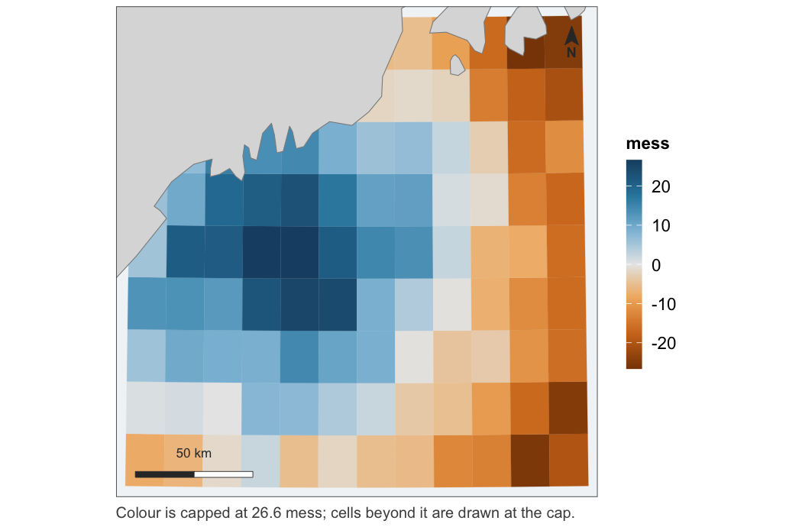
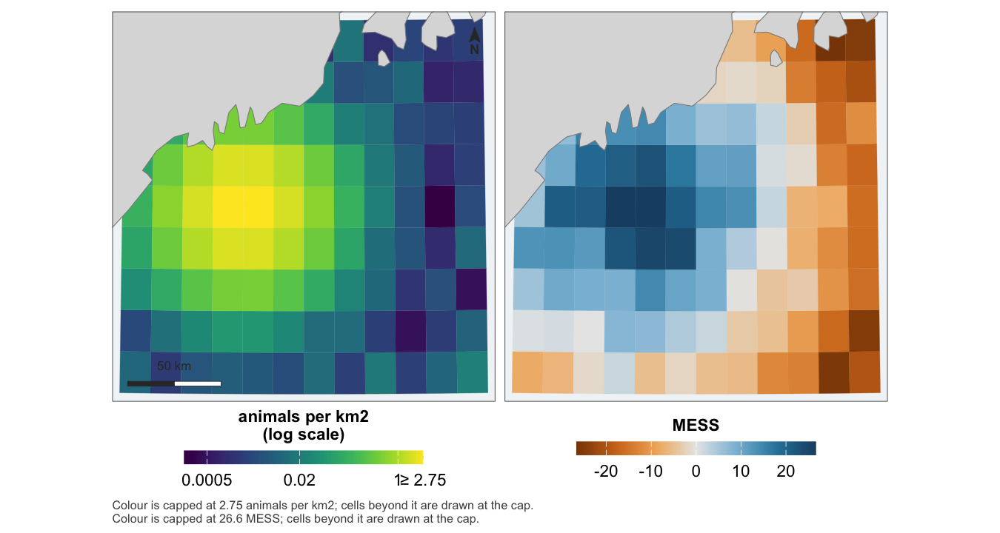
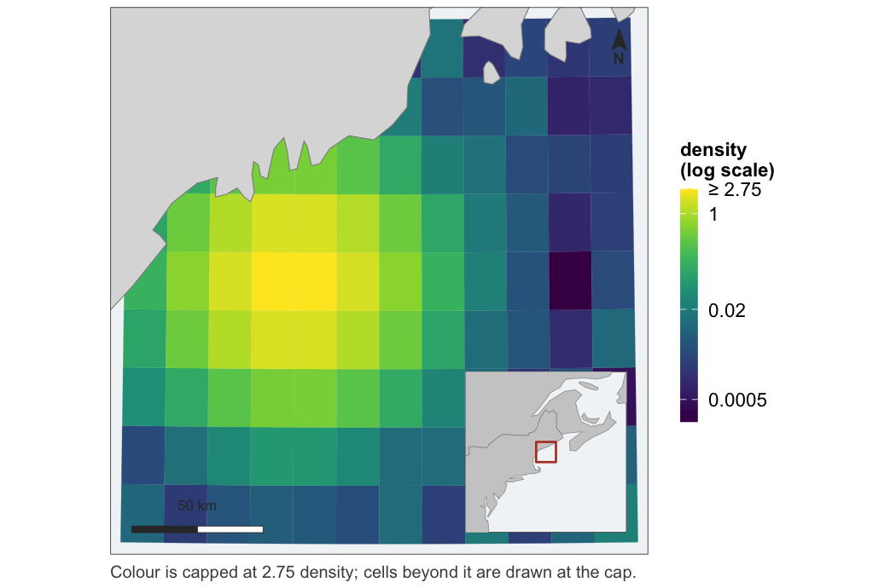
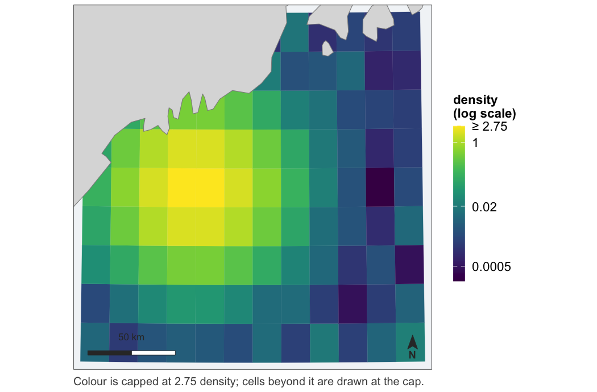
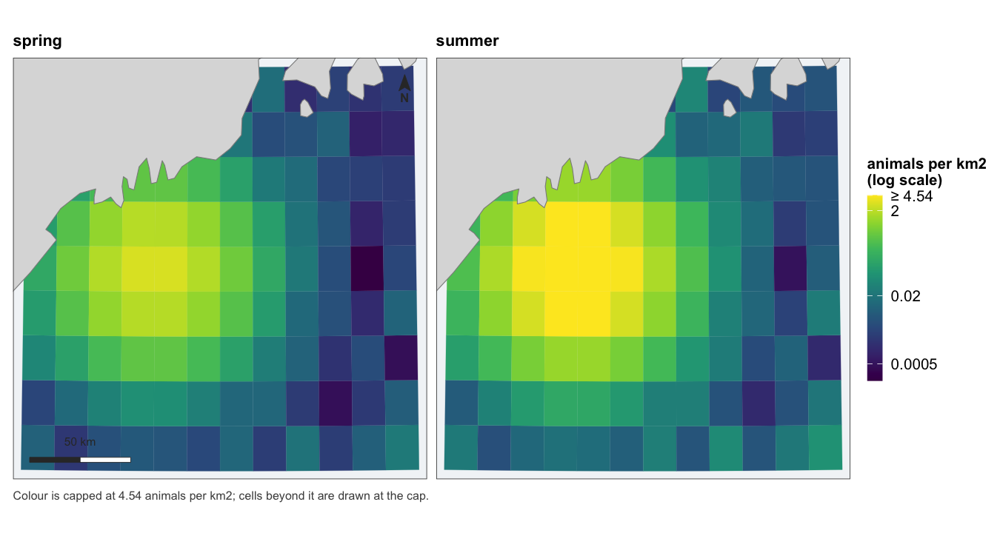
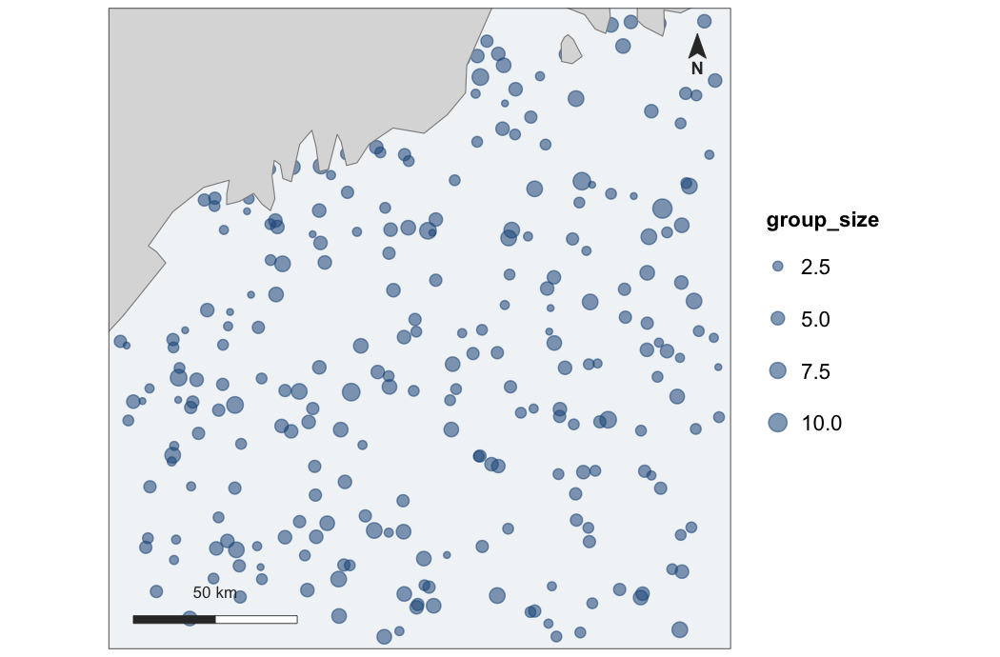
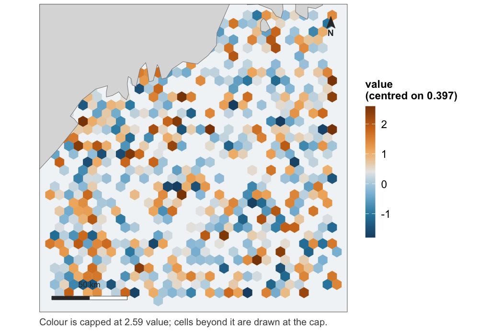

<!-- README.md is generated from README.Rmd. Please edit that file -->

# fancymaps

<!-- badges: start -->

[](https://github.com/chross22/fancymaps/actions/workflows/R-CMD-check.yaml)
<!-- badges: end -->

Documentation:
[camilleross.org/fancymaps](https://camilleross.org/fancymaps/)

Publication-ready maps for spatial model output.

A model that predicts over space produces a map, and a map is not a
heatmap with coordinates. It needs land, so a reader can tell one bay
from another and check that the study area is the water they think it
is. It needs a stated projection, so that area means area. It needs a
colour scale chosen for the quantity being drawn rather than whichever
default fell out. And when a value is shown beside its uncertainty, the
two need to be one figure rather than two that happen to be adjacent.

`fancymaps` draws those maps. It does not compute what goes on them —
density, occupancy, uncertainty and extrapolation are the fitting
package’s job.

It is the map half of a pair:
[`fancyfx`](https://github.com/chross22/fancyfx) plots the same models’
effects and evaluation. See [Sister package](#sister-package-fancyfx)
below.

## Install

``` r
# install.packages("remotes")
remotes::install_github("chross22/fancymaps")
```

## The maps

Every figure below is drawn by the code above it, from `example_grid()`
— a small fixture in the Gulf of Maine carrying one column of each kind
of quantity this package draws. No fitted model, no covariate product
and no network.

``` r
library(fancymaps)
grid <- example_grid()

# a predicted surface
map_surface(grid, "density", label = "animals per km2")
#> scale: log, chosen because the 99th percentile is 170 times the median.
#>   Pass `transform =` to fix it, if two figures need to match.
```



Note what the figure said out loud: the transform was chosen by a rule,
the rule is reported, the legend names it, and the top break is marked
`≥` because the top 1% of cells are drawn at the cap rather than
dropped. That message prints on every call that has to choose; it is
hidden in the examples below only to keep this page readable.

``` r
# a probability, on a scale fixed at 0 and 1
map_probability(grid, "occupancy")
```



``` r
# something with a meaningful centre -- the midpoint is required
map_diverging(grid, "mess", midpoint = 0, direction = -1)
```



``` r
# a value beside its uncertainty, as one figure
map_pair(grid, "density", "mess",
         uncertainty_kind = "diverging", uncertainty_direction = -1,
         labels = c("animals per km2", "MESS"))
```



One extent, one coastline, aligned panels, and the scale bar and north
arrow drawn once — a second of either would measure nothing new.

``` r
# with a locator inset, for saying where in the world this is
map_surface(grid, "density", inset = TRUE)
```



``` r
# furniture goes where the data leaves room for it
map_surface(grid, "density", north_position = "br", scalebar_position = "bl")
```



``` r
# a series, on one shared scale
map_panels(grid, cbind(spring = grid$density, summer = grid$density * 2.5),
           label = "animals per km2")
```



One legend, because there is one scale. Panels that each resolved their
own would be four pictures rather than one comparison.

The effort maps want survey data rather than a grid, so the next two
examples make some up — the package ships only the grid:

``` r
set.seed(1)
sightings <- sf::st_as_sf(
  data.frame(lon = runif(300, -70.4, -68.1),
             lat = runif(300, 42.6, 44.3),
             group_size = rpois(300, 3) + 1),
  coords = c("lon", "lat"), crs = 4326)

segments <- sf::st_as_sf(
  data.frame(lon = runif(900, -70.4, -68.1),
             lat = runif(900, 42.6, 44.3),
             resid = rnorm(900, 0.4, 1)),
  coords = c("lon", "lat"), crs = 4326)
```

``` r
# survey effort, binned when there is too much of it to draw
map_effort(points = sightings, size = "group_size")
```



``` r
# binned values as polygons, for whichever scale the quantity needs --
# residuals, say, which bin like effort but diverge around their own mean
hex <- hex_surface(segments, "resid", fun = "mean")
map_diverging(hex, "value", midpoint = mean(hex$value))
```



## Interactive

The same maps as `leaflet` widgets — pan, zoom, click a cell for its
value:

``` r
leaflet_surface(grid, "density", label = "animals per km2",
                popup = c("depth", "sst"))
leaflet_probability(grid, "occupancy")
leaflet_diverging(grid, "mess", midpoint = 0, direction = -1)

# a pair and a series become a switch rather than two maps
leaflet_pair(grid, "density", "cv")
leaflet_panels(grid, seasons, label = "animals per km2")
```

These are the one set of examples on this page that are not run: a
`leaflet` widget is HTML, and a README on GitHub would show it as
nothing at all. They draw in the [reference
site](https://camilleross.org/fancymaps/) and in the help pages.

A pair and a series put every layer on one map behind a radio control.
That is the better interactive form, not a shortcut: switching layers is
a blink comparison — same cells, same position, same zoom — so nothing
needs aligning because nothing moved. The static `map_pair()` and
`map_panels()` remain the answer when both have to be visible at once.

These exist for the **decisions**, not the rendering — `leaflet` does
that perfectly well on its own. Handing it a grid directly means
re-deciding the scale at the call site, and `leaflet::colorNumeric()`
decides differently: linear, over the full data range, with no capping.
The static figure and the interactive one then show the same numbers in
different colours. These reuse the same scale objects, and the test
suite asserts the two agree at exact hex equality, cell for cell.

One thing to know: land comes from the tile provider, so unlike every
static map here, **these need the network at draw time**.

## What it accepts

Not one blessed type. `as_map_data()` takes:

- `sf` polygons, points and lines,
- a `terra` `SpatRaster`,
- a plain data frame with coordinate columns — which is the form model
  output usually arrives in, since `mgcv` and `dsm` want geometry
  dropped and a prediction rejoined afterwards.

Values may sit on the object as a column, or arrive separately and be
joined by an identifier:

``` r
# a posterior summary, keyed by cell id
occupancy <- setNames(colMeans(posterior_z), grid$grid_id)
map_probability(grid, occupancy, by = "grid_id")
```

That second path is not an afterthought. A posterior summary comes out
of an MCMC fit as a bare vector and a covariate comes out of an
averaging step as a matrix; requiring the caller to bind the column on
first is requiring them to assert the row order matches, and that
assertion is silent when it is wrong. Every unmatched key is an error
naming the key, rather than a hole in the map.

## Things it insists on

**Land, or an explanation.** Drawn by default, at a resolution chosen
from the extent. If no source can be found the map still draws, but it
is captioned to say so — a map with no coastline looks deliberate.
“There is no land in this extent” and “no coastline source was
available” are captioned differently, because they mean opposite things
and look identical.

**One projection per figure.** Taken from the data when it is projected,
and a Lambert azimuthal equal-area centred on the data when it is
lon/lat. Areas are computed in an equal-area projection regardless,
never in the display one.

**That the CRS you state matches the numbers you hand over.** Every
layer in a figure is transformed to one system before anything is drawn,
so they agree by construction. What is checked is the place a coordinate
system is *asserted* rather than read — `crs =` on a plain data frame.
Eastings and northings declared as lon/lat are an error, because
longitude cannot pass 180; degrees declared as metres are a warning,
because read as metres they describe a study area a few hundred metres
across in the wrong ocean. Neither can tell UTM 19N from 20N, and
neither tries.

**A scale that was chosen.** For a skewed quantity, a transform selected
by a stated rule, reported when it fires, and named in the legend, with
breaks at round numbers in the original units. Limits from a quantile,
values beyond them capped rather than dropped, and the top label marked
`≥` so the capping is visible. For a diverging quantity, `midpoint` is
required and has no default — zero for an extrapolation score, the mean
for deviance residuals, never the middle of the range.

**Colours that survive colour blindness.** The ramps are checked by
simulation in the test suite rather than asserted: monotone luminance
under protanopia and deuteranopia for the sequential and bounded ramps,
and measured separation between the two arms of the diverging one.

## Not this package’s job

Interactive maps (`leaflet`, `mapview`), basemap tiles, general GIS, and
deciding the analysis.

## Sister package: fancyfx

[`fancyfx`](https://github.com/chross22/fancyfx) plots what a model
claims — effect curves with a rug of the supporting data above them —
and whether it has earned the claim: ROC, thresholds, calibration,
permutation importance. This package draws where it says it.

The two share a visual identity by construction rather than by
agreement. `theme_fancymap()` is `fancyfx::theme_fancyfx()` with the
axis furniture removed, so the fonts, the sizes and the legend styling
come from one place and change in one place.

The dependency runs one way: `fancymaps` imports `fancyfx`, and
`fancyfx` knows nothing about `fancymaps`. That is the right direction —
the maps package needs the effects package’s identity, not the other way
round — and it means map rendering’s hard dependency on `sf` never
reaches someone who installed a package to plot a partial effect.

Some things stay over there on purpose. `fancyfx::mess()` and
`plotExtrapolation()` are statements about a *model*, not about a map,
so they belong beside the ROC curves — and what they produce is a common
thing to hand to `map_diverging()`. `fancyfx::hex_bin()` is reused
directly by `map_effort()` rather than reimplemented.

## In use

[`dsmfit`](https://github.com/chross22/dsmfit), the distance-sampling
pipeline this package was specified against, now draws its maps through
it: the projection-and-extrapolation pair, the binned residual map, and
the spatial partial effect. Every figure that repository’s requirements
note listed as hand-drawn and wrong in a named way is drawn by a tested
function here instead — and converting it caught two defects in this
package that no test had: `hex_surface()` did not exist, and a capped
panel of `map_pair()` said nothing. Drawing the figures on this page
caught three more: the fix for that second one overprinted its own
caption, `map_effort()` had been ignoring `value` and `size` since it
was written, and `map_panels()` drew its collected legend at the
proportions of a legend it was not drawing. Fixing those surfaced a
fourth by reading — a pair had never carried the no-land note at all.
`DECISIONS.md` records all six.

## Documentation

|  |  |
|----|----|
| [Choosing a scale](vignettes/scales.Rmd) | why `trans = "sqrt"` is not a scale, and what replaces it |

## Development

``` r
devtools::test()                 # includes 14 vdiffr snapshots
testthat::snapshot_review()      # look at any figure that changed
```

Snapshot baselines are platform-specific — svglite records text widths
from system font metrics — so a first run elsewhere reports typography
diffs rather than regressions. See `DECISIONS.md`.

## See also

`DECISIONS.md` records the choices, the measurements behind them, and
the bugs found while making them.
