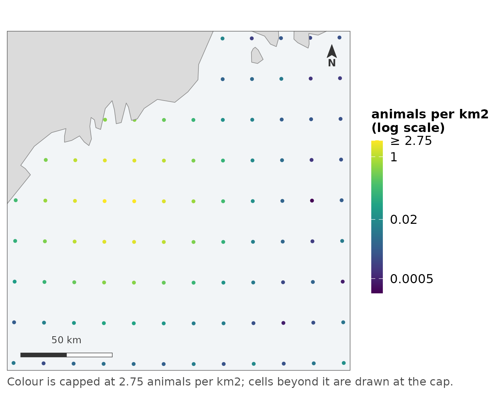
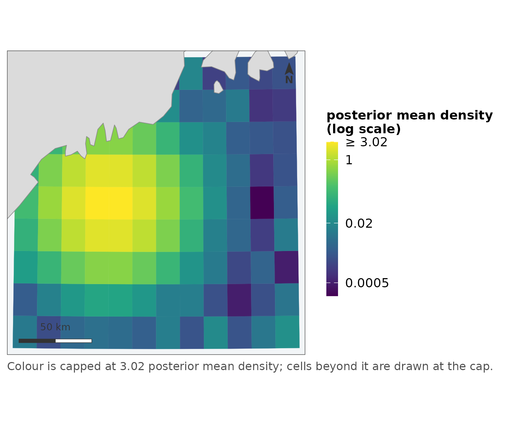
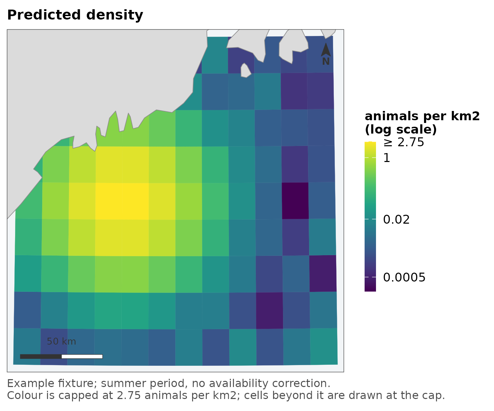
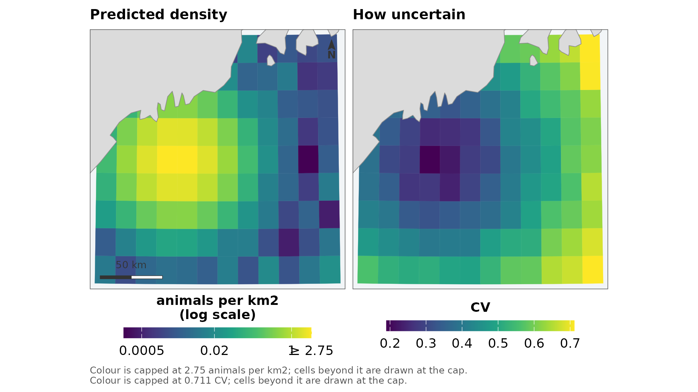
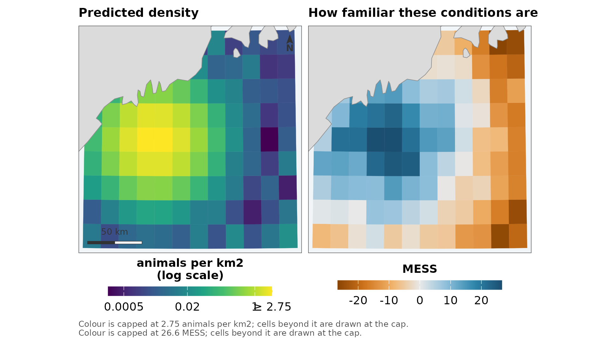
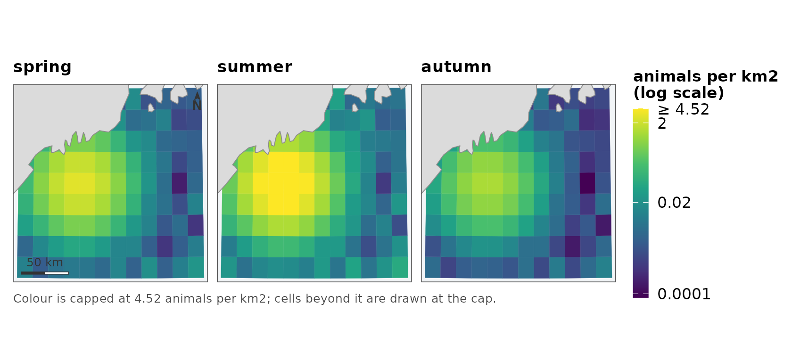
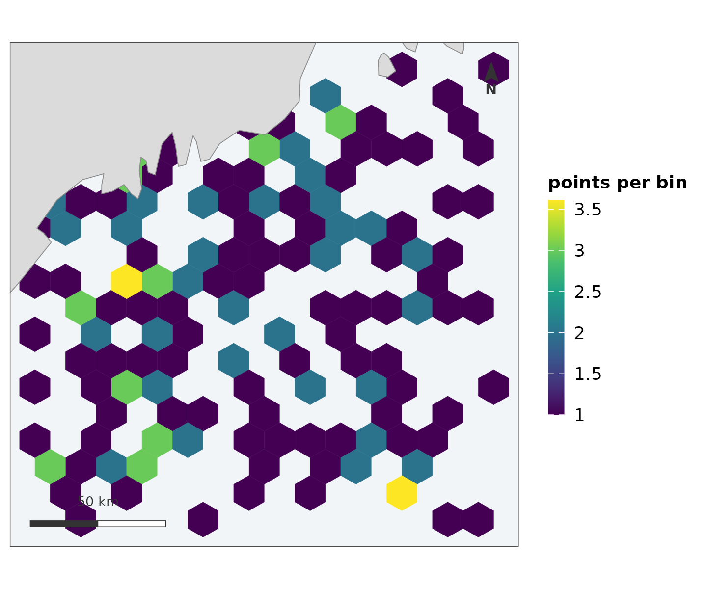

# From model output to figure

A spatial model ends in a handful of figures: the predicted surface,
that surface beside its uncertainty, the same surface across seasons,
and the effort that produced the data. This vignette walks that pipeline
once, from the forms model output actually arrives in to the figures a
manuscript carries, and ends with the two mistakes that the first
pipeline to adopt this package made – both of them upstream of the
package, and both worth knowing about before they cost you an afternoon.

Everything here draws from
[`example_grid()`](https://camilleross.org/fancymaps/reference/example_grid.md),
a small `sf` grid in the Gulf of Maine with one column of each kind of
quantity these models emit, and from
[`coastline_fixture()`](https://camilleross.org/fancymaps/reference/coastline.md),
a bundled shoreline. Substitute your own grid and the calls do not
change.

## The forms output arrives in

Model output reaches the figure stage in one of three shapes, and
\[[`as_map_data()`](https://camilleross.org/fancymaps/reference/as_map_data.md)\]
– called for you by every map function – accepts each of them.

**An `sf` object with the predictions as columns.** The tidiest case,
and the one
[`example_grid()`](https://camilleross.org/fancymaps/reference/example_grid.md)
is in:

``` r

grid
#> Simple feature collection with 108 features and 6 fields
#> Geometry type: POLYGON
#> Dimension:     XY
#> Bounding box:  xmin: -70.4 ymin: 42.6 xmax: -68 ymax: 44.4
#> Geodetic CRS:  WGS 84
#> First 10 features:
#>    grid_id     density        cv       mess occupancy  residual
#> 1        1 0.009878606 0.5614851  -7.785698 0.3145203 0.8803216
#> 2        2 0.001922370 0.5210795  -6.429409 0.3271094 1.8712034
#> 3        3 0.004958808 0.5097867  -1.471500 0.3812665 2.2532980
#> 4        4 0.006967122 0.5160391   2.156948 0.4320310 0.1539027
#> 5        5 0.006013330 0.4959027  -5.118395 0.3532427 1.0915647
#> 6        6 0.003623981 0.4909970  -1.877589 0.4942128 1.6331130
#> 7        7 0.011750856 0.5305635  -5.086500 0.3655276 0.6826059
#> 8        8 0.002369372 0.5808266  -5.588622 0.1815860 0.6690951
#> 9        9 0.018671704 0.5843726 -12.558177 0.3131686 0.6171332
#> 10      10 0.002329346 0.6506995 -13.457523 0.2258503 1.1586996
#>                          geometry
#> 1  POLYGON ((-70.4 42.6, -70.2...
#> 2  POLYGON ((-70.2 42.6, -70 4...
#> 3  POLYGON ((-70 42.6, -69.8 4...
#> 4  POLYGON ((-69.8 42.6, -69.6...
#> 5  POLYGON ((-69.6 42.6, -69.4...
#> 6  POLYGON ((-69.4 42.6, -69.2...
#> 7  POLYGON ((-69.2 42.6, -69 4...
#> 8  POLYGON ((-69 42.6, -68.8 4...
#> 9  POLYGON ((-68.8 42.6, -68.6...
#> 10 POLYGON ((-68.6 42.6, -68.4...
```

**A plain data frame with coordinate columns.** What remains once
geometry has been dropped for modelling, which is most modelling. Two
numeric columns say nothing about whether they are degrees or metres, so
`crs` is required rather than guessed:

``` r

proj <- equal_area_crs(grid)
centres <- sf::st_centroid(sf::st_geometry(sf::st_transform(grid, proj)))

flat <- data.frame(sf::st_coordinates(centres), density = grid$density)
head(flat, 3)
#>           X         Y     density
#> 1 -90127.58 -88285.41 0.009878606
#> 2 -73741.65 -88480.87 0.001922370
#> 3 -57355.17 -88637.23 0.004958808

map_surface(flat, "density", coords = c("X", "Y"), crs = proj,
            label = "animals per km2", coastline = land)
```



**A named vector keyed by cell id.** The form a posterior summary or a
lookup table arrives in – values computed elsewhere, matched back to the
grid by `by`:

``` r

posterior_mean <- setNames(grid$density * 1.1, grid$grid_id)

map_surface(grid, posterior_mean, by = "grid_id",
            label = "posterior mean density", coastline = land)
```



The join is checked: every name must be found in the `by` column, and a
missing key stops the call rather than leaving a hole. A partial join
produces a map with gaps that looks exactly like a region where the
model had nothing to say, and nobody catches that by looking.

To see what a map will draw before it draws it, call
[`as_map_data()`](https://camilleross.org/fancymaps/reference/as_map_data.md)
yourself:

``` r

as_map_data(grid, "density")
#> <map_data> polygon | 108 features
#>   crs:   EPSG:4326 
#>   value: density [0.000202, 2.83]
```

## The deliverable

``` r

map_surface(grid, "density", label = "animals per km2",
            coastline = land,
            title = "Predicted density",
            caption = "Example fixture; summer period, no availability correction.")
#> scale: log, chosen because the 99th percentile is 170 times the median.
#>   Pass `transform =` to fix it, if two figures need to match.
```



Note what happened without being asked: the projection was chosen and
applied to every layer, the scale went logarithmic because the data are
skewed – and said so, both in the console and in the legend – and the
top percentile was capped, with the top break marked `≥` rather than the
bright cells being dropped.
[`vignette("scales")`](https://camilleross.org/fancymaps/articles/scales.md)
is the full argument for each of those choices; the short version is
that anything the figure had to decide is reported on the figure, where
a reader can see it.

The caption is where provenance belongs – which period, which product,
which correction was not applied – and anything the function had to
decide is appended to it rather than replacing it.

## The value beside its uncertainty

A predicted surface without its uncertainty is half a claim.
\[[`map_pair()`](https://camilleross.org/fancymaps/reference/map_pair.md)\]
draws the two as one figure: same extent, same projection, same
coastline, aligned panels, furniture once.

``` r

map_pair(grid, "density", "cv",
         labels = c("animals per km2", "CV"),
         titles = c("Predicted density", "How uncertain"),
         coastline = land)
```



The legends stay separate on purpose – density and CV are different
quantities in different units, and a shared ramp would be a lie. What
the panels share is extent, projection, position, size and typography,
which is what makes the pairing read as one figure.

When the uncertainty is a signed score rather than a spread – an
extrapolation surface, say – the right panel diverges instead:

``` r

map_pair(grid, "density", "mess",
         uncertainty_kind = "diverging", uncertainty_direction = -1,
         labels = c("animals per km2", "MESS"),
         titles = c("Predicted density", "How familiar these conditions are"),
         coastline = land)
```



## The series

Panels drawn separately cannot be compared and look as though they can:
each one stretches its own range across the full ramp, and the bright
patch in a sparse year is drawn in the same yellow as the bright patch
in an abundant one.
\[[`map_panels()`](https://camilleross.org/fancymaps/reference/map_panels.md)\]
puts every panel on one scale with one legend, which is the only
arrangement in which “brighter” means “more”.

``` r

seasons <- cbind(spring = grid$density,
                 summer = grid$density * 2.5,
                 autumn = grid$density * 0.4)

map_panels(grid, seasons, label = "animals per km2", coastline = land)
```



The matrix form – one row per cell, one column per period, column names
becoming titles – is the shape an averaging or posterior step emits, so
usually nothing needs reshaping.

## The effort

The map that answers “where did you look”, which reviewers ask for and
pipelines draw last:

``` r

set.seed(11)
midpoints <- sf::st_as_sf(
  data.frame(lon = stats::runif(200, -70.3, -68.2),
             lat = stats::runif(200, 42.7, 44.2)),
  coords = c("lon", "lat"), crs = 4326)

map_effort(points = midpoints, bin = TRUE, bins = 15, coastline = land)
```



## The two coordinate-system questions

A map involves two different CRS questions, answered by two different
functions on purpose.

**What is the map drawn in?**
\[[`display_crs()`](https://camilleross.org/fancymaps/reference/display_crs.md)\]
decides once per figure and applies the answer to every layer. Projected
data keeps its own projection – if the analysis was in UTM 19N,
reprojecting for the figure alone would draw something slightly other
than what was fitted. Geographic data is projected to a Lambert
azimuthal equal-area centred on the data, because drawing raw lon/lat is
what makes a northern study area look stretched.

**What are areas measured in?**
\[[`equal_area_crs()`](https://camilleross.org/fancymaps/reference/equal_area_crs.md)\]
and
\[[`area_km2()`](https://camilleross.org/fancymaps/reference/area_km2.md)\],
for the abundance-by-region arithmetic, which should never be done in
whatever CRS happened to be convenient for display.

The one thing worth doing deliberately: when a manuscript carries
several maps, pass the same `crs` to all of them, for the same reason
you would fix `transform` and `limits` – figures that are going to be
compared should not each resolve their own defaults.

## Two mistakes to make only once

Both were made by the first pipeline that adopted this package, both are
upstream of anything a map function can check, and both produced figures
that looked fine.

**Annotating a finished map with
[`geom_sf()`](https://ggplot2.tidyverse.org/reference/ggsf.html)
silently discards the extent.** A returned map carries a
[`coord_sf()`](https://ggplot2.tidyverse.org/reference/ggsf.html)
holding the resolved projection and the fixed extent; adding another
`geom_sf` layer replaces that coordinate system and the map quietly
re-fits its limits to the union of the data. Annotate with
[`geom_point()`](https://ggplot2.tidyverse.org/reference/geom_point.html)
or
[`geom_text()`](https://ggplot2.tidyverse.org/reference/geom_text.html)
in the display CRS’s own units instead – or, for a study-area outline,
pass `region =`, which exists so the common case never meets this
problem.

**A model frame in kilometres has to be multiplied back before
mapping.** Pipelines rescale coordinates to kilometres for numerical
stability, and a grid whose “metres” are actually kilometres draws a map
one thousandth the size – with a scale bar labelled in units that make
it look plausible, because 400 is a believable number in either unit.
Nothing downstream can catch this; the fix is a comment at the rescaling
site and a glance at the scale bar on the first figure.

## Where to next

- [`vignette("scales")`](https://camilleross.org/fancymaps/articles/scales.md)
  – why the colour scales do what they do, and how to override each
  decision.
- \[[`leaflet_surface()`](https://camilleross.org/fancymaps/reference/leaflet-maps.md)\]
  and friends – the same maps as interactive widgets, built from the
  same scale objects so a cell is the same colour in both renderers.
