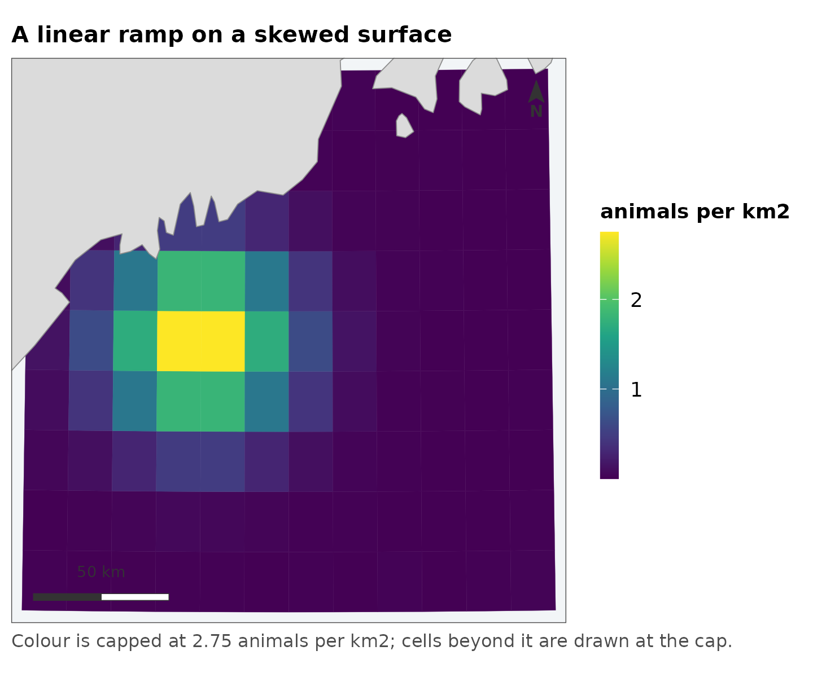
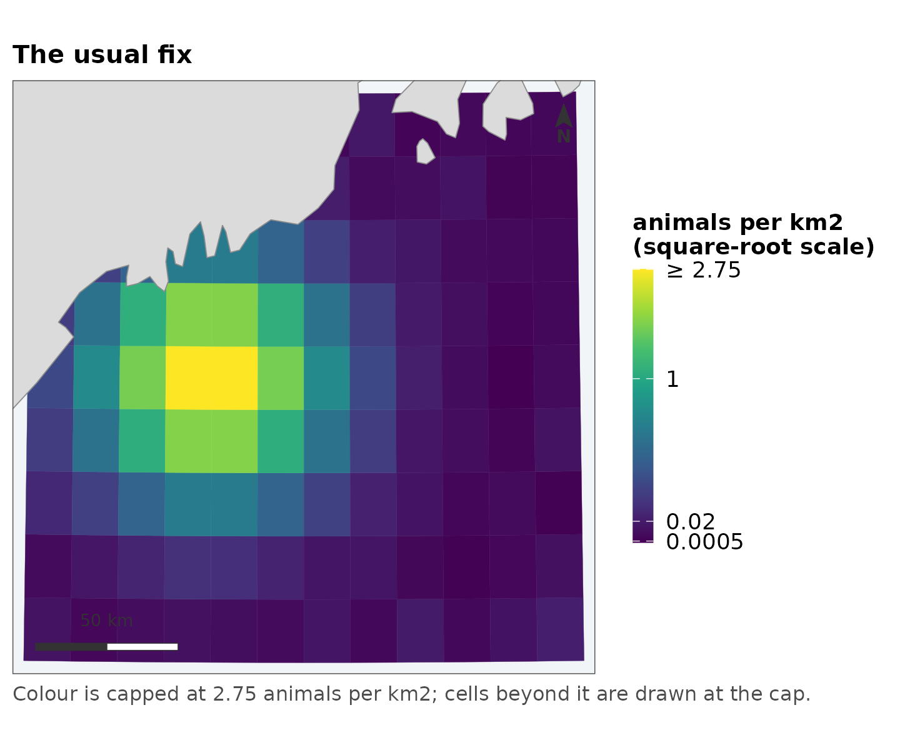
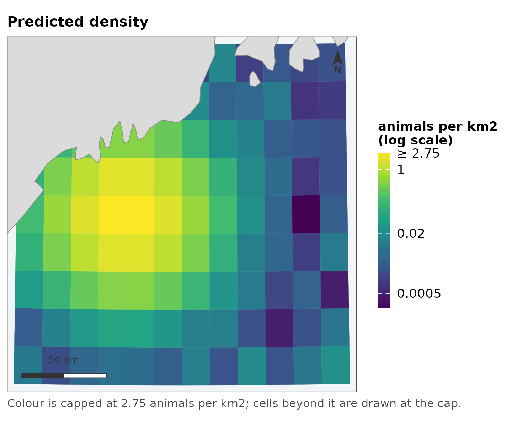
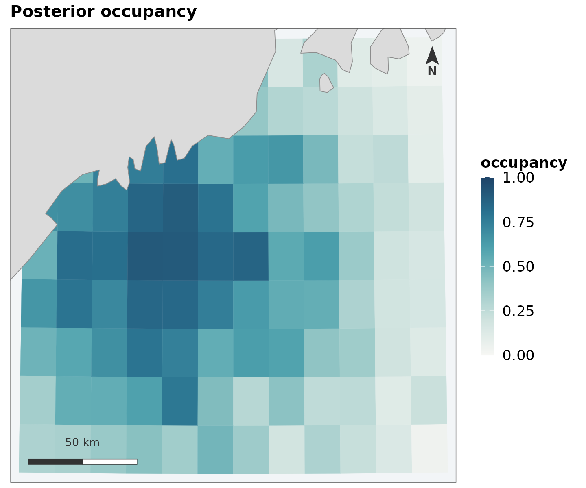
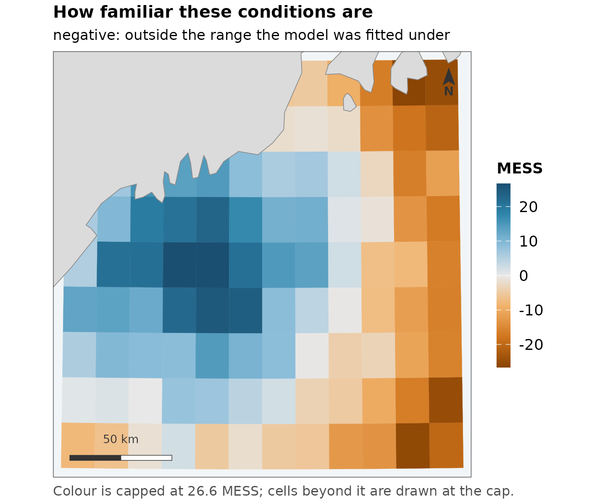
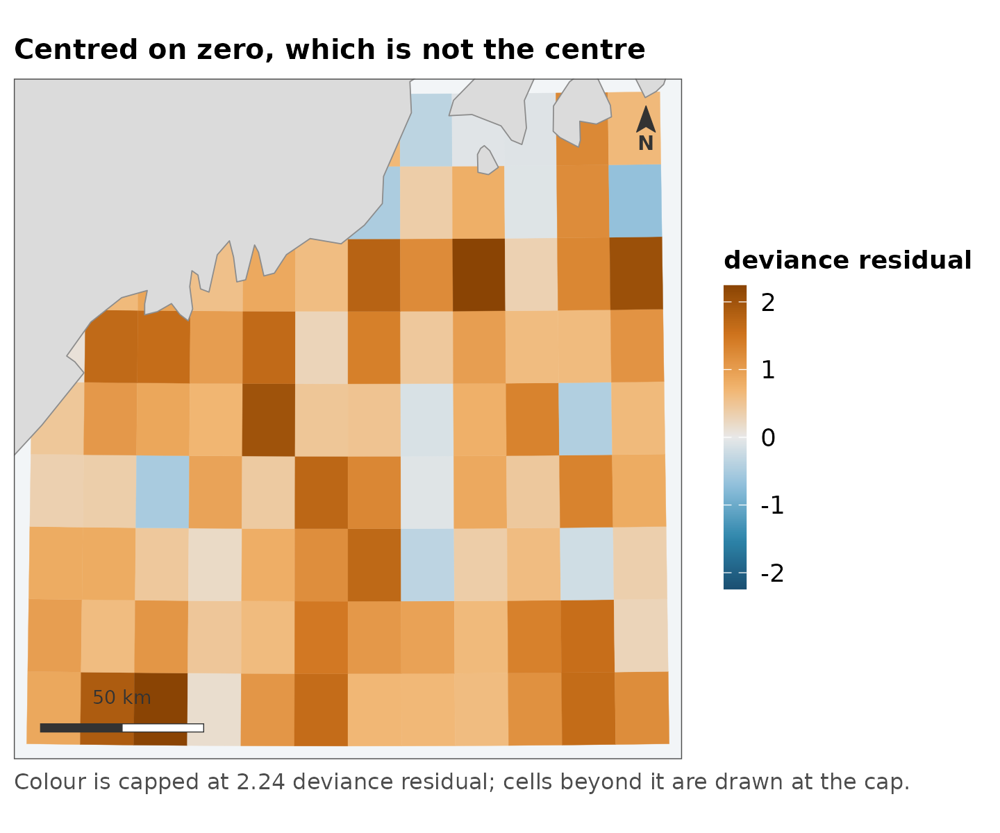
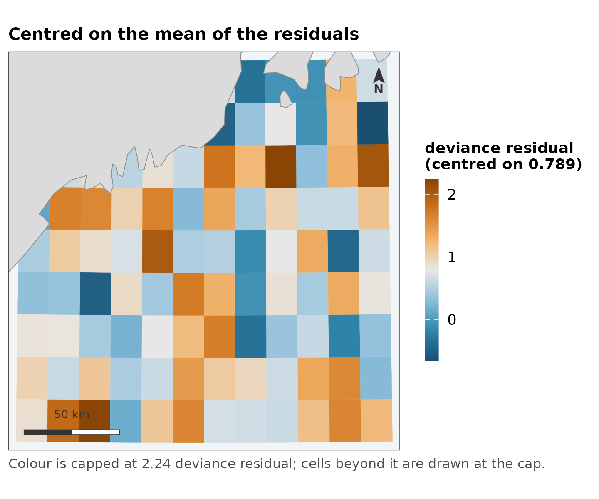
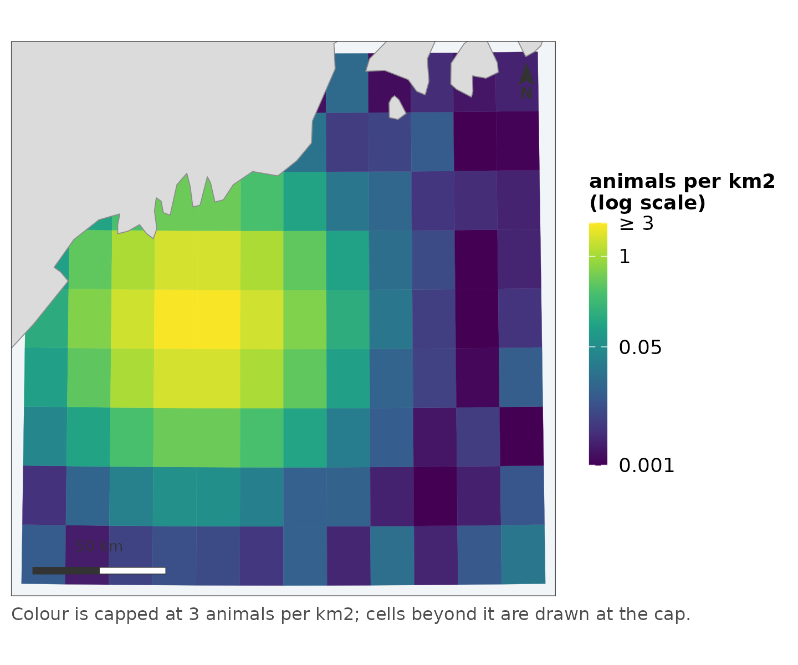
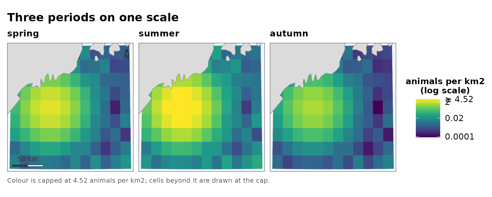
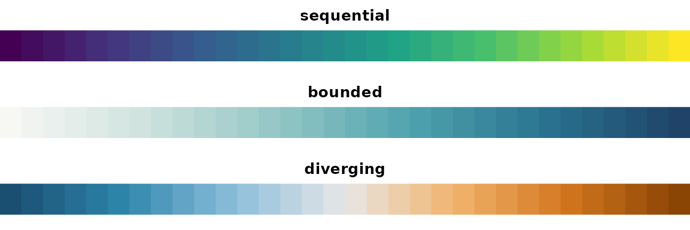

# Choosing a scale

A map scale is where most of the information in a spatial model either
arrives or is thrown away, and it is almost always chosen by default.
This vignette is about the defaults this package uses instead, and about
why each one is what it is – because a default you cannot argue with is
a default you cannot correct.

## The problem, on a real quantity

Predicted density from a distance-sampling model is severely skewed. A
handful of cells carry most of the animals and the rest carry almost
none, which is not a defect of the model but a fact about how animals
are distributed.

``` r

summary(grid$density)
#>      Min.   1st Qu.    Median      Mean   3rd Qu.      Max. 
#> 0.0002019 0.0035859 0.0159718 0.2654158 0.1423366 2.8302221

# how far the top of the range is above the middle
round(quantile(grid$density, 0.99) / median(grid$density))
#> 99% 
#> 172
```

The 99th percentile is over a hundred times the median. Drawn linearly,
the scale spends nearly all of its colour range on values that almost no
cell has:

``` r

map_surface(grid, "density", transform = "identity",
            label = "animals per km2", coastline = land,
            title = "A linear ramp on a skewed surface")
```



One bright spot on a dark field. The map is not wrong – it is an
accurate picture of a quantity most of whose variation is at the bottom
of the range, drawn on a scale with no resolution there.

## What is wrong with `trans = "sqrt"`

The usual response is a square-root transform, and it does look better:

``` r

map_surface(grid, "density", transform = "sqrt", label = "animals per km2",
            coastline = land, title = "The usual fix")
```



Three things are wrong with stopping here, and none of them is that the
figure looks bad.

**Nothing chose the square root.** It is the transform that happened to
help. Nothing about density says the interesting comparisons are between
square roots of it, and if the skew had been milder or worse the same
call would have been made anyway.

**The breaks are wherever the algorithm put them.** They are round
numbers in square-root space, which is not a space the reader is in.

**The legend does not say the axis is not linear.** A reader who does
not already know reads evenly spaced labels as an evenly spaced
quantity, and every comparison they make from the figure is wrong by the
transform.

## What replaces it

``` r

map_surface(grid, "density", label = "animals per km2", coastline = land,
            title = "Predicted density")
#> scale: log, chosen because the 99th percentile is 170 times the median.
#>   Pass `transform =` to fix it, if two figures need to match.
```



Four things changed, and all four are visible in the legend.

### The transform is chosen by a stated rule

The rule is the ratio of the 99th percentile to the median: below 10,
the values are drawn linearly; at or above 10, logarithmically.
\[[`surface_scale()`](https://camilleross.org/fancymaps/reference/surface_scale.md)\]
does the choosing and can be called on its own to see what a map is
going to do before it does it:

``` r

spec <- surface_scale(grid$density)
#> scale: log, chosen because the 99th percentile is 170 times the median.
#>   Pass `transform =` to fix it, if two figures need to match.
spec$limits
#> [1] 0.0002018698 2.7492085541
spec$breaks
#> [1] 0.000500 0.020000 1.000000 2.749209
```

It says so when it fires, because a default that varies with the data is
a default that has to be visible:

``` r

invisible(surface_scale(grid$density))
#> scale: log, chosen because the 99th percentile is 170 times the median.
#>   Pass `transform =` to fix it, if two figures need to match.
```

Ten is a judgement, not a theorem. It is roughly where a linear ramp
stops having any resolution in the middle of the data, and the point of
writing it down is that you can disagree with it in one place rather
than per figure.

### Zeros do not disappear

A log scale cannot show a zero and a density surface is full of them.
The transform is `log(x + offset)`, where `offset` is the 5th percentile
of the positive values:

``` r

spec$note
#> [1] "log scale"
```

`log(x + 1)` would have been simpler and is the common choice. It is
also wrong in a way that is easy to miss: adding 1 to a density in
animals per km2 is adding an enormous amount, and adding 1 to the same
quantity in animals per m2 is adding almost nothing. The same code would
produce two different figures from the same data in different units. A
percentile of the data has no units problem, and the legend reports it.

### Breaks are round in the reader’s units

`0.0005`, `0.002`, `0.01` – powers of ten and their doubles and halves,
in animals per km2, which is the quantity being discussed. Not round
numbers in log space, which are round in a space nobody is looking at.

Four labels is the ceiling. It is set by the narrowest legend this
package draws, which is a horizontal colourbar under one panel of a
paired figure, and a log scale’s labels are long.

### The scale is capped, and says so

Limits come from a quantile rather than the range, so one extreme cell
cannot flatten everything else. Values past the cap are **squished** to
it rather than dropped:

``` r

spec$squished
#> [1] TRUE
max(grid$density) > spec$limits[2]
#> [1] TRUE
```

Dropping them would colour those cells `NA` grey – and grey already
means “the model said nothing here”, so a censored cell would be
reporting the wrong thing in a colour that already has a meaning.

Two things then say the cap is there. The top break is the cap itself,
marked:

``` r

spec$labels(spec$breaks)
#> [1] "0.0005" "0.02"   "1"      "≥ 2.75"
```

and the figure carries a caption saying so, which is why the map above
has one without being given any text.

## A bounded quantity is a different problem

Occupancy probability is not a skewed positive quantity that happens to
stop at 1, and
\[[`map_probability()`](https://camilleross.org/fancymaps/reference/map_probability.md)\]
treats it as its own kind:

``` r

map_probability(grid, "occupancy", label = "occupancy", coastline = land,
                title = "Posterior occupancy")
```



**The ends are fixed at 0 and 1**, not taken from the data. A map whose
values ran from 0.2 to 0.6, stretched across a full ramp, would use
exactly the colours a map running 0 to 1 uses – and those are not the
same claim. Fixed ends also mean 0.6 is the same colour in every figure,
which is what makes a series of seasons comparable at a glance.

**The ramp is different too.** A sequential ramp puts its most saturated
colour at the top of the observed data; here the top is certainty. A
cell at 0.02 should look nearly like a cell at 0, with weight arriving
only as the value approaches 1.

## A diverging quantity needs a centre, and it has no default

\[[`map_diverging()`](https://camilleross.org/fancymaps/reference/map_diverging.md)\]
requires `midpoint`:

``` r

map_diverging(grid, "mess")
#> Error:
#> ! `midpoint` is required, and it has no sensible default.
#>   Zero for an extrapolation score, where zero is where the training range ends.
#>   mean(values) for deviance residuals, which do not average zero -- centring those on zero colours every cell the same.
```

That is deliberate, and it is the one place this package refuses to
guess.
\[[`ggplot2::scale_fill_gradient2()`](https://ggplot2.tidyverse.org/reference/scale_gradient.html)\]
falls back to the middle of the range, which is almost never the
meaning.

For an extrapolation score, zero is the meaning: it is where inside the
training range becomes outside it.

``` r

map_diverging(grid, "mess", midpoint = 0, direction = -1, label = "MESS",
              coastline = land,
              title = "How familiar these conditions are",
              subtitle = "negative: outside the range the model was fitted under")
```



`direction = -1` is there because which end of a ramp carries the visual
weight is a claim about which end matters, and it cannot be derived from
the numbers. On an extrapolation surface the values a reader has to see
are the negative ones – they are where the model is guessing – and they
are a small minority.

### The case that makes this worth enforcing

Deviance residuals do not average zero. Centring them on zero puts
almost every cell on one side of the ramp and colours them all much the
same:

``` r

mean(grid$residual)
#> [1] 0.7888862

map_diverging(grid, "residual", midpoint = 0, label = "deviance residual",
              coastline = land, title = "Centred on zero, which is not the centre")
```



Centred on their own mean, the same numbers show where the model runs
high and where it runs low:

``` r

map_diverging(grid, "residual", midpoint = mean(grid$residual),
              label = "deviance residual", coastline = land,
              title = "Centred on the mean of the residuals")
```



Both figures are of the same data. The first is the one you get from a
default.

## Several figures that have to match

An automatic choice depends on the data it sees, so two figures of
different data can end up on different scales. When they must match,
there are two ways round it.

**Fix the scale explicitly**, and pass the same values to every call:

``` r

map_surface(grid, "density", transform = "log", limits = c(0.001, 3),
            label = "animals per km2", coastline = land)
```



**Or let
\[[`map_panels()`](https://camilleross.org/fancymaps/reference/map_panels.md)\]
do it**, which computes one scale over every panel pooled and gives them
a single collected legend:

``` r

seasons <- cbind(spring = grid$density,
                 summer = grid$density * 2.5,
                 autumn = grid$density * 0.4)

map_panels(grid, seasons, label = "animals per km2", coastline = land,
           title = "Three periods on one scale")
#> scale: log, chosen because the 99th percentile is 250 times the median.
#>   Pass `transform =` to fix it, if two figures need to match.
```



This is worth insisting on. A per-panel scale makes each panel a picture
of its own relative pattern and then lays them out in a grid that
invites reading across – so a quiet season and a busy one look
identical, and the difference between them, the only thing a series is
for, is the one thing that has been scaled away.

## The colours themselves

Three ramps, and they are checked rather than asserted. The package’s
test suite simulates protanopia and deuteranopia and requires that the
sequential and bounded ramps keep **monotone luminance** under both – so
their ordering survives when the hue difference does not – and that the
two arms of the diverging ramp stay measurably separated.

``` r

fancymap_palette("sequential")
#> [1] "#440154" "#46337E" "#365C8D" "#277F8E" "#1FA187" "#4AC16D" "#A0DA39"
#> [8] "#FDE725"

op <- par(mfrow = c(3, 1), mar = c(1, 0, 2, 0))
for (type in c("sequential", "bounded", "diverging")) {
  pal <- fancymap_palette(type, 32)
  image(matrix(seq_along(pal)), col = pal, axes = FALSE, main = type)
}
```



``` r

par(op)
```

The diverging ramp is blue against orange rather than the more usual
blue against red. Red–green confusion is the common deficiency, and a
red arm collapses toward the neutral middle under deuteranopia – which
is precisely the failure that matters, since the whole job of a
diverging ramp is to make “which side of the centre” legible.

## The same scale, interactively

The `leaflet_*()` functions reuse these scale objects rather than
re-deciding anything, so a cell is the same colour in a static figure
and an interactive one. Handing a grid to
[`leaflet::colorNumeric()`](https://rstudio.github.io/leaflet/reference/colorNumeric.html)
directly would decide the scale again at the call site – linear, over
the full data range, with no capping – and the two figures would show
the same numbers in different colours.

``` r

leaflet_surface(grid, "density", label = "animals per km2")
```

## In short

| the quantity | the function | what is decided for you | what you must decide |
|----|----|----|----|
| skewed, positive | [`map_surface()`](https://camilleross.org/fancymaps/reference/map_surface.md) | transform, breaks, cap | nothing |
| bounded on 
``` math
0, 1
``` | [`map_probability()`](https://camilleross.org/fancymaps/reference/map_probability.md) | ends fixed at 0 and 1 | nothing |
| has a meaningful centre | [`map_diverging()`](https://camilleross.org/fancymaps/reference/map_diverging.md) | symmetric limits | **`midpoint`** |
| a series | [`map_panels()`](https://camilleross.org/fancymaps/reference/map_panels.md) | one scale over all panels | nothing |

Everything in the third column is an argument, and every automatic
choice is reported when it is made. The point is not that these defaults
are right for every dataset. It is that they are written down, so a
figure that needs something else can say what and why.
